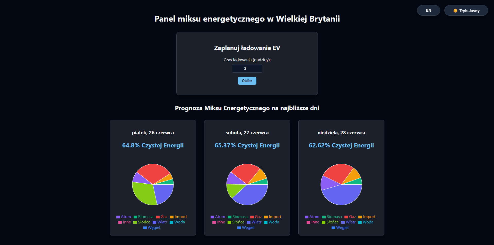
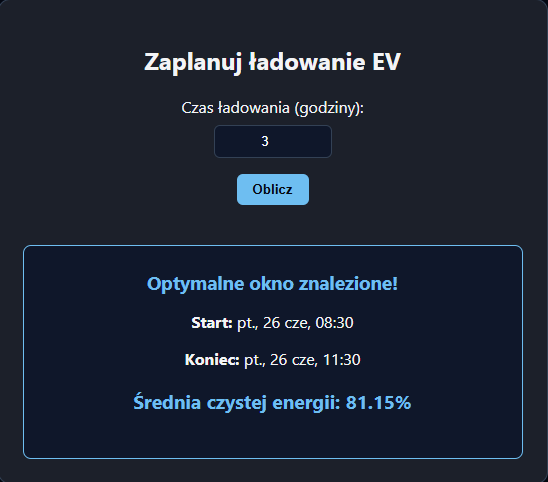

# UK Energy Mix - Frontend Dashboard

A React-based web application providing real-time insights and forecasts into the United Kingdom's energy generation mix.

🌐 **Live Application:** [frontend-energy-mix.onrender.com](https://frontend-energy-mix.onrender.com)

---

## Screenshots

### Desktop View

> *The main dashboard featuring the daily energy mix forecast, displayed with interactive pie charts (Recharts) and global theme controls.*

### EV Charging Calculator

> *The built-in calculator finding the optimal charging window based on the highest average of clean energy generation.*

---

## Key Features

* **Energy Mix Forecast:** Visualizes the daily energy generation breakdown using interactive charts.
* **Smart EV Calculator:** Determines the most eco-friendly time window to charge an electric vehicle based on live grid data.
* **Theme Switching:** Built-in Light and Dark modes for optimal user experience.
* **Internationalization (i18n):** Seamless toggling between English (EN) and Polish (PL) languages.

## Tech Stack

* **Framework:** React 18 (TypeScript)
* **Charting:** Recharts
* **Styling:** Custom CSS (with CSS variables for theme management)
* **i18n:** react-i18next
* **Build Tool:** Vite
* **Deployment:** Render.com (Static Site)

